# Insurance Analytics Platform — Architecture Diagram

## Pipeline Overview (Mermaid - renderiza automaticamente no GitHub)

```mermaid
%%{init: {'theme': 'dark', 'themeVariables': {'primaryColor': '#1a1a2e', 'primaryTextColor': '#fff', 'primaryBorderColor': '#7B42BC', 'lineColor': '#F8B229', 'secondaryColor': '#16213e'}}}%%

flowchart LR
    subgraph Sources["📁 Source Systems"]
        direction TB
        P["Policy Flat File<br/>─────────<br/>1. Mapping<br/>2. Transform<br/>3. Data Quality"]
        C["Claims Flat File<br/>─────────<br/>1. Mapping<br/>2. Transform<br/>3. Data Quality"]
    end

    subgraph Collect["🗂️ COLLECT"]
        S3C["Object Storage<br/>─────────<br/>DataSource/<br/>├── Policy/<br/>├── Claims/<br/>└── Quarantine/"]
    end

    subgraph Orchestration["⚙️ Orchestration"]
        direction TB
        SM["State Machine<br/><i>orchestrates data<br/>movement left to right</i>"]
        ETL["ETL Engine<br/><i>PySpark distributed<br/>processing</i>"]
    end

    subgraph Cleanse["🧹 CLEANSE & CURATE"]
        direction TB
        FN["Serverless Trigger"]
        S3P["Parquet Files<br/>─────────<br/>ETL Jobs perform:<br/>• Mapping<br/>• Transformations<br/>• Data Quality<br/>• SQL Statements<br/>• Data Lineage"]
        DQ["Data Quality<br/>Validation Failures"]
        KV["Key-Value Store<br/>─────────<br/>• Data lineage logs<br/>• Lookup values<br/>• DQ check results"]
    end

    subgraph Consume["📊 CONSUME"]
        direction TB
        S3F["Parquet Files<br/><i>Analytics-ready</i>"]
        CAT["Data Catalog<br/><i>Schema metadata</i>"]
        QE["Query Engine<br/><i>SQL on-demand</i>"]
        BI["BI Dashboard<br/><i>Visualizations</i>"]
    end

    subgraph Future["🤖 FUTURE: AI/ML"]
        direction TB
        ML["ML Models<br/><i>Fraud Detection<br/>Risk Scoring</i>"]
        AI["GenAI Agent<br/><i>Document Processing<br/>NL Queries</i>"]
    end

    subgraph CICD["🔄 DevSecOps Cycle"]
        direction TB
        IaC["Infrastructure as Code"]
        CI["CI/CD Pipeline"]
        SEC["Security Scanning"]
    end

    P --> S3C
    C --> S3C
    S3C -->|"①"| FN
    FN -->|"②"| SM
    SM --> ETL
    ETL -->|"③"| DQ
    FN -->|"④"| S3P
    S3P -->|"⑤"| S3F
    S3F -->|"⑥"| CAT
    CAT -->|"⑦"| QE
    QE -->|"⑧"| BI
    S3F -.->|"⑨"| ML
    S3F -.->|"⑩"| AI
    KV <--> S3P

    style Sources fill:#2d2d44,stroke:#7B42BC
    style Collect fill:#1a3a4a,stroke:#F8B229
    style Cleanse fill:#1a3a2a,stroke:#4CAF50
    style Consume fill:#3a2a1a,stroke:#FF9800
    style Future fill:#1a2a3a,stroke:#2196F3
    style CICD fill:#3a1a2a,stroke:#E91E63
```

## Layer Description

| # | Layer | What Happens |
|---|---|---|
| ① | Trigger | New file detected → serverless function fires |
| ② | Orchestrate | State machine coordinates the full pipeline |
| ③ | Quarantine | Failed quality checks → isolated for review |
| ④ | Transform | Schema mapping, type conversion, PII protection, lookups |
| ⑤ | Publish | Columnar format (Parquet), partitioned by date |
| ⑥ | Catalog | Metadata registered for discovery and governance |
| ⑦ | Query | SQL engine scans only needed columns/partitions |
| ⑧ | Visualize | Dashboards with calculated KPIs (Loss Ratio, GWP) |
| ⑨ | Predict | ML models for fraud detection, risk scoring (future) |
| ⑩ | Augment | GenAI for document extraction, natural language BI (future) |

## Technology Mapping (Generic → Specific)

| Generic Component | Implementation |
|---|---|
| Object Storage | Amazon S3 |
| Serverless Trigger | AWS Lambda |
| State Machine | AWS Step Functions |
| ETL Engine | AWS Glue (PySpark) |
| Key-Value Store | Amazon DynamoDB |
| Data Catalog | AWS Glue Data Catalog |
| Query Engine | Amazon Athena |
| BI Dashboard | Amazon QuickSight |
| ML Models | Amazon SageMaker |
| GenAI Agent | Amazon Bedrock |
| Infrastructure as Code | Terraform |
| CI/CD Pipeline | GitHub Actions |
